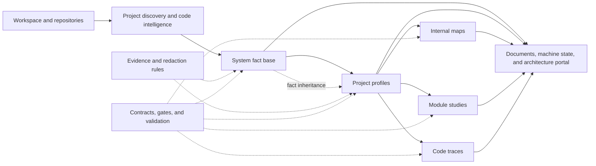

# Kantu

**English** | [简体中文](./README.zh-CN.md)

> Evidence-driven architecture reconnaissance for complex, multi-repository software systems—built for [DeepSeek Harness](https://github.com/deepseek-ai/deepseek-harness).

Kantu helps AI agents genuinely take over an unfamiliar software system—not merely browse directories, count files, or produce an architecture summary that sounds complete.

It brings source discovery, evidence collection, system modeling, project profiling, layer gates, parallel orchestration, deterministic validation, and an architecture portal into one recoverable, verifiable, and extensible scanning protocol, delivered as a native DeepSeek Harness plugin.

**Project status: early design and incubation.** This repository is establishing the plugin architecture and its first trustworthy end-to-end workflow. No installable release is available yet. This README describes what we are building, not a list of features that are already complete.

## Why Kantu

When an agent enters a large codebase for the first time, the easiest result to produce is one that is locally correct but globally wrong:

- seeing a dependency and assuming it is enabled in production;
- seeing a few directories and treating them as the real business boundaries;
- scanning one repository while ignoring its role in the wider system;
- generating pages of conclusions with no traceable evidence;
- dispatching parallel agents without a shared fact base or conflict resolution;
- losing a session and no longer knowing what was completed or which results remain trustworthy.

Kantu starts from a different premise:

> Architecture understanding is not a one-shot code summary. It is an engineering process—from evidence to conclusions and from local detail to system context—that must be verifiable and recoverable.

## What makes Kantu different

### Evidence before conclusions

Every important conclusion should point to reviewable evidence. Anything that cannot be proven must be marked for confirmation. A capability visible in source code is not necessarily enabled in production.

### Establish the system worldview before profiling projects

Kantu does not let multiple agents independently interpret a system without shared context. A system-level fact base first aligns production boundaries, project identities, infrastructure, entry points, and terminology. Project-level analysis then inherits those facts.

### Let models reason; let programs enforce discipline

Models handle judgment and synthesis. Deterministic programs handle state machines, task plans, contract validation, identity resolution, batch recovery, and sensitive-data checks.

### Multi-repository from day one

Project identity is based on the workspace-relative path, not the directory basename. Repositories with the same name, nested repositories, aggregation directories, and composite projects are never silently merged.

### Native to the plugin runtime

Kantu is not a long prompt wrapped in an npm package. It is designed around Cordis services, model-facing tools, capability providers, and a Harness bundle so that scanning capabilities can be composed, replaced, hot-reloaded, and reused.

## Analysis model

Kantu uses layers to control analysis order and the boundaries of each conclusion:

| Layer | Question | Primary artifact |
|---|---|---|
| System | What kind of system is this? What are its boundaries, entry points, projects, and infrastructure? | System fact base |
| Project | What role does this project play? How is it built, run, and connected to external capabilities? | Project profile |
| Internal map | Which business-capability candidates, technical components, and contract components are visible in source? | Navigable project map |
| Module study | How are the boundaries, entry points, data, and dependencies of one responsibility organized? | Module report |
| Code trace | How does a specific endpoint, task, message, exception, or data flow execute? | Traceable execution path |

The internal map is optional navigation and does not claim to be the one correct module decomposition. Module studies and code traces both require a project profile, but neither depends on the other.

## How it works



A complete scan is not one giant prompt. It is a sequence of inspectable stages:

1. Recursively discover real Git repositories and assign stable identities.
2. Select and record the available code-intelligence capability, such as a code graph, LSP, or file search.
3. Collect system-level evidence; a single writer normalizes terminology and resolves conflicts.
4. Pass the system gate before analyzing projects in isolated contexts.
5. Use immutable task snapshots and machine-readable run state for parallel work.
6. Deterministically validate document structure, evidence references, state fields, and sensitive values.
7. Enter internal maps, module studies, or code traces only when needed.
8. Aggregate the result into human-readable reports and a navigable architecture portal.

## Planned experience

Kantu aims to let users express intent in natural language while Harness tools provide explicit execution semantics:

```text
Build a system-level fact base for this workspace.

Analyze the role of order-service in the wider system.

Scan every project that passes the gate in parallel. Preserve failed tasks so the run can resume.

Trace the order endpoint from its controller to database writes and message publication.
```

The model-facing tools will be organized around capabilities like these. Exact names will stabilize before the first public release:

```text
scan system
scan project
scan all projects
build project map
scan module
trace code
show status
resume run
validate artifacts
```

Users should interact with a small set of clear analysis intents, not a long list of platform-specific commands.

## Planned artifacts

By default, Kantu writes analysis artifacts to an isolated output directory and does not modify business code:

```text
kantu_docs/
├── system/
│   ├── system-facts.md
│   ├── project-registry.json
│   └── index-manifest.json
├── projects/
│   └── <project-key>/
│       ├── project-profile.md
│       ├── internal-map/
│       ├── modules/
│       └── code-traces/
├── runs/
│   └── <run-id>/
│       ├── plan.json
│       ├── state.json
│       └── task-snapshots/
└── portal/
    └── index.html
```

The exact layout and contracts may change during early development. Keeping scan artifacts separate from business source code is intended to remain a stable rule.

## Plugin architecture direction

Kantu is designed around the following internal boundaries:

```text
Kantu Bundle
├── Kantu Service
│   ├── Scan state machine
│   ├── Tasks and recovery
│   ├── Artifact management
│   └── Contract validation
├── Model-facing Tools
├── Capability Providers
│   ├── Code Intelligence
│   ├── Workspace Discovery
│   ├── Subagent Orchestration
│   └── Runtime Evidence
├── Analysis Protocol
│   ├── Prompts
│   ├── Evidence Rules
│   └── Layer Gates
└── Report and Portal Generator
```

A code graph will be the preferred discovery mechanism, but never the only one. Kantu will use capability interfaces to support codebase-memory, LSP, file search, and future providers.

## Discovery and distribution

Kantu will follow the official DeepSeek Harness plugin discovery convention. At public release, this repository will carry the exact [`dsh-plugin`](https://github.com/topics/dsh-plugin) GitHub topic so it can appear in the Harness plugin discovery ecosystem.

Discoverability alone is not enough. Every release must also:

- ship as an installable bundle with a `dsh.bundle` manifest;
- provide a prebuilt npm package so ordinary users do not need to build source during installation;
- support installation and removal with `dsh plugin --profile <name> add <package>`;
- expose its configuration layer through `dsh --profile <name> --dump-config`;
- document a copyable install command, compatible Harness versions, and a minimal verification path;
- manage compatibility changes with semantic versions, GitHub Releases, and explicit migration notes.

Being indexed by the topic does not imply endorsement by DeepSeek. Kantu treats “discoverable, installable, and verifiable” as one release gate—not as a label alone.

## Design principles

- **Traceable evidence:** Important conclusions must lead back to source, configuration, runtime material, operations documentation, or human confirmation.
- **Bounded facts:** “Visible in source,” “declared in configuration,” “runtime-confirmed,” and “enabled in production” are different states.
- **Explicit uncertainty:** Missing, conflicting, and low-confidence information is part of the formal result.
- **Inherited upstream facts:** Lower layers report conflicts for review instead of silently rewriting the system worldview.
- **Deterministic gates:** Rules that programs can decide should not depend on a model remembering to comply.
- **Context isolation:** Project and module tasks receive only the context required to complete their responsibility.
- **Recoverable execution:** Long-running, multi-project scans expose status, preserve failures, and resume after interruption.
- **Safe defaults:** Kantu does not modify business code or expose secrets, tokens, passwords, private keys, or complete sensitive endpoints by default.
- **Replaceable models and tools:** The core protocol does not depend on one model, index engine, or code-search tool.

## What Kantu is not

- It is not a counter for lines, directories, and dependencies.
- It is not a giant prompt that pours every repository into one context.
- It is not an architecture-fiction generator that infers production topology from source alone.
- It is not an automatic source of truth that replaces architects, developers, or operations confirmation.
- It is not a coding agent that modifies or “helpfully refactors” the scanned business code by default.

Kantu aims to provide a more trustworthy starting point and a path for analysis that can be deepened and reviewed over time.

## Origin

Kantu grew out of `wantwant-project-scan`, a multi-project system takeover skill practiced in OpenCode and Kimi Code CLI.

That skill validated several core ideas: a system-level fact base, project-level context isolation, evidence discipline, versioned contracts, immutable batch snapshots, recoverable run state, and an architecture portal. Kantu carries those lessons forward without copying platform-specific adapters. It reorganizes the stable protocol and deterministic capabilities as a native DeepSeek Harness plugin.

## Roadmap

### Phase 1: Minimum trustworthy loop

- [ ] Establish the TypeScript plugin project and Harness bundle
- [ ] Define the Kantu Service, configuration schema, and foundational tools
- [ ] Implement multi-repository discovery and stable project identities
- [ ] Complete system fact-base generation and deterministic validation
- [ ] Test plugin loading and the tool pipeline without a live model API

### Phase 2: Project analysis and recoverable orchestration

- [ ] Isolated single-project scans
- [ ] Project-type detection and template selection
- [ ] Immutable task snapshots, batch state, and failure recovery
- [ ] Subagent Provider integration
- [ ] Project-document contracts and quality gates

### Phase 3: Deep analysis and system maps

- [ ] Project internal maps
- [ ] Module studies
- [ ] Code execution traces
- [ ] Architecture portal
- [ ] Runtime-evidence Providers

### Phase 4: Open ecosystem

- [ ] Stable Provider interfaces
- [ ] Third-party project types and report Profiles
- [ ] Custom evidence sources and organization policy packs
- [ ] Headless, Web, and automation workflow integration
- [ ] Publish a prebuilt npm bundle and verify standard installation and removal
- [ ] Add the `dsh-plugin` GitHub topic and verify that Kantu appears in the ecosystem discovery entry point

The roadmap will evolve alongside the Developer Preview APIs of DeepSeek Harness.

## Contributing

At this stage, Kantu needs careful discussion of problem boundaries and protocol design more than a large volume of feature code. Useful questions include:

- Which facts are hardest to establish when taking over a large multi-repository system?
- Which architecture conclusions must require runtime evidence?
- What context contamination and conflicts most often appear in parallel agent analysis?
- What report contracts work well for both human review and machine validation?
- Which code-intelligence Providers should be supported first?
- How should we measure whether an architecture scan is trustworthy, rather than merely long?

Interfaces, names, and directory layouts remain open for discussion before the first runnable release. Once a public contract exists, migration paths and compatibility notes will take priority.

## Acknowledgements

- [DeepSeek Harness](https://github.com/deepseek-ai/deepseek-harness), for the “Everything is a Plugin” agent harness and Cordis plugin runtime.
- `wantwant-project-scan`, for the practical foundation in system scanning, evidence discipline, and multi-project orchestration.

---

**Kantu does not try to draw a beautiful architecture diagram whose claims have never been proven. It cares whether every important claim on that diagram knows where it came from.**
