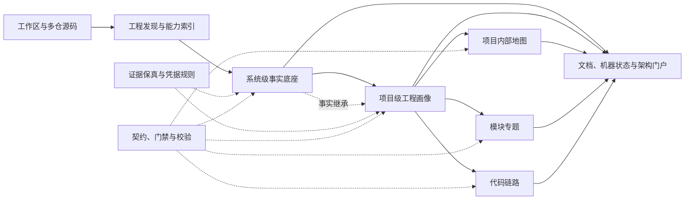

# ArchScope

[English](./README.md) | **简体中文**

> 面向复杂、多仓软件系统的证据驱动架构勘探引擎——为 [DeepSeek Harness](https://github.com/deepseek-ai/deepseek-harness) 而生。

**先看清系统，再修改代码。**

ArchScope 希望帮助 AI Agent 真正接手一个陌生软件系统，而不只是浏览目录、统计文件或生成一篇看似完整的架构总结。

它把源码发现、证据采集、系统建模、项目画像、层级门禁、并行编排、结果校验和架构门户组织成一套可恢复、可验证、可扩展的扫描协议，并以 DeepSeek Harness 插件的形式提供这些能力。

**项目状态：v0.1.0 建立了首个可运行的系统级源码扫描预览版；npm 包尚未发布。** ArchScope 现在可以发现 Git 工程，为每个工程建立或复用独立的 codebase-memory 索引，启动隔离的只读证据 worker，再由当前 DSH 主 Agent 综合 22 章节系统事实底座，并对机器产物与 Markdown 执行门禁校验。运行态证据、项目级扫描和恢复编排仍在开发中。

> **核心模型：系统级定世界观，项目级定工程画像，模块级定内部边界，代码级定具体链路。**

模块分析横向梳理能力与职责，代码分析纵向追踪真实执行路径。

## 为什么需要 ArchScope

当一个 Agent 第一次进入大型代码库时，最容易得到的是“局部正确、整体失真”的答案：

- 看见一个依赖，就推断它已经在生产环境启用；
- 看见几个目录，就把它们当成系统的真实业务边界；
- 扫描单个仓库，却忽略它在多工程系统中的角色；
- 生成大量自然语言结论，却没有可追溯证据；
- 并行派发多个任务，却缺少统一事实底座和冲突仲裁；
- 一次会话中断后，无法判断已经完成了什么、哪些结果仍然可信。

ArchScope 的出发点是：

> 架构理解不是一次性的代码摘要，而是一条从证据到结论、从局部到整体、可以校验和恢复的工程流程。

## ArchScope 有什么不同

### 证据优先，而不是结论优先

每个重要结论都应指向可复核的证据。无法证明的内容必须标记为待确认；源码中存在的能力，不等于生产环境实际启用。

### 先建立系统世界观，再分析单个项目

ArchScope 不会让多个 Agent 在没有共同语境的情况下各自解释系统。系统级事实底座先统一生产边界、工程身份、基础设施、入口和术语，项目级分析再继承这些事实。

### 模型负责推理，程序负责纪律

适合判断和归纳的工作交给模型；状态机、任务计划、契约校验、身份解析、批次恢复、精确关系统计、可移植路径检查和凭据秘密检查交给确定性程序。

### 从第一天支持多仓系统

项目身份使用工作区相对路径，而不是目录 basename。同名仓库、嵌套仓库、聚合目录和复合工程不会被静默合并。

### 原生融入插件运行时

ArchScope 不是把一份长提示词套进 npm 包。它计划以 Cordis 服务、模型工具、能力 Provider 和 Harness bundle 的方式接入 DeepSeek Harness，让扫描能力可以被组合、替换、热更新和复用。

## 分析模型

ArchScope 使用分层模型控制分析顺序和结论边界：

| 层级 | 回答的问题 | 主要产物 |
|---|---|---|
| 系统级 | 这是一个怎样的系统？边界、入口、工程和基础设施是什么？ | 系统级事实底座 |
| 项目级 | 这个工程在系统中扮演什么角色？如何构建、运行和依赖外部能力？ | 工程画像 |
| 项目内部地图 | 源码中有哪些业务能力候选、技术组件和契约组件？ | 可导航的项目地图 |
| 模块专题 | 某项职责相关代码的边界、入口、数据和依赖如何组织？ | 模块专题报告 |
| 代码链路 | 某个接口、任务、消息、异常或数据流具体如何执行？ | 可追踪的执行链路 |

项目内部地图是可选导航，不宣称给出唯一正确的模块划分。模块专题和代码链路都依赖项目级画像，但二者互不依赖。

## 工作方式



一次完整扫描不是单个大 Prompt，而是由多个可检查阶段组成：

1. 递归发现真实 Git 工程并建立稳定身份；
2. 选择并记录代码发现能力，例如代码图谱、LSP 或文件搜索；
3. 采集系统级证据，由单一写者统一术语并仲裁冲突；
4. 通过系统级门禁后，再按项目隔离上下文进行分析；
5. 使用不可变任务快照和运行状态组织并行任务；
6. 对文档结构、证据引用、状态字段和敏感值执行确定性校验；
7. 在需要时继续进入项目地图、模块专题或代码链路；
8. 汇总为人类可阅读的报告和可导航的系统架构门户。

## 当前 MVP 使用体验

ArchScope 计划让用户通过 Harness 工具用自然语言表达目标。当前对用户提供 `archscope_scan_system` 与 `archscope_status`；系统扫描内部还注册主 Agent 接力所需的综合上下文与提交工具，更深层的分析能力会继续复用同一个服务边界。

```text
为这个工作区建立系统级事实底座。

分析 order-service 在整个系统中的角色。

并行扫描所有满足门禁的项目，失败任务保留现场并允许恢复。

追踪下单接口从 Controller 到数据库与消息发布的完整源码链路。
```

需要确定性控制或脚本化调用时，同一组意图使用统一、严格的命令命名空间：

```text
/archscope system [--refresh]
/archscope help
```

命令同时接受 `系统级扫描` 与 `帮助` 两个中文子命令别名。Slash command 使用严格解析，不猜测错误输入；参数不合法时只返回用法说明。`system` 会依次完成工程发现、独立索引和逐工程证据采集，随后自动把运行交给当前 DSH 主 Agent；主 Agent 加载完整系统协议和结构化 evidence，综合事实底座与三张图，再交由插件执行确定性校验。整个过程会在主对话中汇报阶段与四分位进度。首次扫描或 `--refresh` 可能耗时较长；普通扫描会按工程绝对根路径复用已有索引。已完成或正在等待主 Agent 综合且协议版本一致的运行可以复用，`BLOCKED` 运行会在下次执行时重新尝试。

DeepSeek Harness 当前不会在完全空白的新会话中分发 Slash Command。请先选择已有会话，或发送一条普通消息创建会话后再运行 `/archscope`。命令候选项本身也会显示这项限制，避免第一次交互静默失败。

`/archscope` 与 `/archscope help` 会把使用指南作为正常的助手回复发布到对话中，命令结果本身不再承载长文本，避免帮助内容看起来像工具卡片或 Think 记录。

源码视角的索引和证据全部完成后，系统门禁可以进入 `READY`；这仍不等于生产拓扑已得到确认。缺失 MCP 工具、索引失败、worker 失败或越界读取都会让门禁保持 `BLOCKED`。`system` 与 `help` 是当前公开的 Slash Command；项目级扫描与恢复流程在实现前不再出现在用户帮助中。机器可读状态继续通过 `archscope_status` 提供给模型编排，不再作为手动 Slash 子命令暴露。

后续模型工具会围绕以下能力继续扩展：

```text
scan system
scan project
scan all projects
build project map
scan module
trace code
show status
resume run
validate artifacts
```

我们希望用户面对的是一组清晰的分析意图，而不是一长串平台特定命令。

## 当前系统级扫描产物

ArchScope 默认只在独立输出目录中写入分析产物，不修改业务代码：

```text
archscope_docs/
├── system/
│   ├── 00-system-fact-base.md
│   ├── project-registry.json
│   ├── index-manifest.json
│   ├── evidence/
│   │   ├── index.json
│   │   └── <project-key>.json
│   ├── relations.json
│   ├── protocol-lock.json
│   ├── synthesis.json
│   ├── validation.json
│   ├── history.json
│   └── diagrams/
│       ├── 01-system-context.mmd
│       ├── 02-internal-relations.mmd
│       └── 03-entry-overview.mmd
├── runs/
│   ├── latest.json
│   └── <run-id>/
│       ├── state.json
│       ├── system/                    # 不可变终态快照
│       │   ├── 00-system-fact-base.md
│       │   ├── evidence/
│       │   └── diagrams/
│       └── synthesis/
│           └── attempt-<n>/
│               ├── attempt.json
│               ├── 00-system-fact-base.md
│               └── diagrams/
```

`system/` 始终代表最近一次校验通过并正式发布的事实底座。新扫描会先把工程注册表、索引和 evidence 暂存在自己的 `runs/<run-id>/system/` 中，因此扫描进行中或最终校验失败都不会覆盖上一版可用文档。每次进入终态的系统综合都会获得 `S0001` 这样的递增事实版本；终态快照和每次综合尝试默认全部保留。`system/history.json` 负责关联事实版本、run id、校验与门禁状态、不可变产物路径，以及当前发布版本。

每个工程的原始结构化证据先写入独立文件，系统事实底座只由当前 DSH 主 Agent 综合，避免并行 worker 互相污染或竞争写文档。`auto` 模式会在 evidence 不超过 512 KiB 时全量注入；超过阈值后改用有界摘要，主写者可按需补取 1-8 个高影响工程的完整持久化证据，但不会获得文件系统或代码搜索权限。与此同时，每个 worker 必须输出类型化关系候选，ArchScope 会将其完整、无裁剪地聚合到 `system/relations.json`，并始终全量注入系统综合。主 Agent 负责跨工程理解、术语统一、关系判断、冲突仲裁和最终表达；插件中的正则分类与名称匹配只能作为候选输入，不能直接成为最终结论。

插件会记录主写者会话、模型和输入输出摘要到 `system/synthesis.json`，并把每次提交的草稿及校验结果保存在当前 run 的 `synthesis/attempt-<n>/` 目录。确定性校验会覆盖文档结构、证据边界、正文与机器关系统计是否一致、本机绝对路径、真实凭据泄漏、图表边语义，以及真实“阻断项目级”问题与下层门禁是否一致。具体路由、代码符号、配置与实现细节仍保留在逐工程 evidence JSON 中。源码证据齐备且没有真实项目级阻断项时，文档可以标记为“完整（源码视角）”并打开项目级门禁；运行态事实仍会明确标记为待确认，综合校验通过也不等于生产架构已经得到证明。

代码定义、路由和调用关系优先由 codebase-memory 提供。对于图谱容易遗漏的 manifest、README、CI、容器和部署配置，ArchScope 会在父进程中执行工程根目录约束、符号链接拒绝、文件与总量限制以及真实凭据移除，再把安全元数据基线交给证据 worker。本地事实产物会保留真实服务名、域名、IP、路由、表名、Topic、Queue 等架构标识。worker 不会获得任意文件读取、shell 或写入能力。

### 系统级 Protocol Pack

ArchScope 将系统级分析知识作为版本化的 `protocol/` 目录随插件发布。协议包包含证据、工程身份、索引状态、22 章节系统文档与层级门禁的机器契约；包含分析边界、本地事实保真与凭据处理、输出路径和校验策略；也包含会被真实注入当前 DSH 主 Agent 的完整系统主写者指令，以及只读 evidence worker 的聚焦提示。

插件会在运行时加载并校验这份目录。每次扫描都会生成 `system/protocol-lock.json`，记录协议包版本、manifest 以及每个资源的 SHA-256 摘要。协议包发生变化后，ArchScope 会创建新运行，不会静默复用旧规则下的结果。适合程序执行的约束已经迁入 TypeScript 并由测试守护；Markdown 是可审阅的协议正文，而不是无人执行的附件。

### 配置

| 配置项 | 默认值 | 作用 |
|---|---|---|
| `workspaceRoot` | 当前 DSH 会话工作区 | 可选扫描根覆盖；相对路径以会话工作区为基准解析 |
| `outputDirectory` | `archscope_docs` | 工作区内部的产物目录 |
| `discoveryMaxDepth` | `3` | 递归发现 Git 根的最大深度 |
| `codebaseMemoryServerName` | `codebase_memory_mcp` | codebase-memory MCP 工具的 DSH namespace |
| `indexMode` | `moderate` | 新建或刷新索引时使用的 `fast` / `moderate` / `full` 模式 |
| `evidenceProvider` | `spawn` | 用于逐工程只读证据任务的 DSH subagent provider |
| `systemConcurrency` | `4` | 索引和证据任务的最大并发数 |
| `evidenceContextMode` | `auto` | `auto` 在字节阈值内全量注入，`full` 始终全量注入，`bounded` 始终压缩 |
| `fullEvidenceMaxBytes` | `524288` | `auto` 模式全量注入 evidence 的 UTF-8 字节上限 |
| `registerCommand` | `true` | 注册可选的 `/archscope` 命令 |
| `registerSystemScanTool` | `true` | 注册 `archscope_scan_system` |
| `registerStatusTool` | `true` | 注册 `archscope_status` |
规范命名记录在 [`docs/brand.md`](./docs/brand.md)。

ArchScope bundle 会同时挂载 DeepSeek Harness 官方 `@deepseek-ai/dsh-mcp-client`，并通过 stdio 启动 `codebase-memory-mcp`。因此运行前需要确保该可执行文件在启动 DSH 的 `PATH` 中：

```bash
command -v codebase-memory-mcp
```

安装插件后，可用下面的命令确认 MCP 与 ArchScope 两个配置层都已出现：

```bash
dsh --profile web --dump-config | rg -n -C 6 "archscope-codebase-memory|codebase_memory_mcp|dsh-archscope"
```

本地开发可执行 `pnpm install`，随后运行 `pnpm check`。ArchScope 目前尚未发布到 npm，公开安装命令会随首个版本一并提供。

## 插件架构方向

ArchScope 计划采用以下内部边界：

```text
ArchScope Bundle
├── ArchScope Service
│   ├── 扫描状态机
│   ├── 任务与恢复
│   ├── 产物管理
│   └── 契约校验
├── Model-facing Tools
├── Capability Providers
│   ├── Code Intelligence
│   ├── Workspace Discovery
│   ├── Subagent Orchestration
│   └── Runtime Evidence
├── Analysis Protocol
│   ├── Prompts
│   ├── Evidence Rules
│   └── Layer Gates
└── Report & Portal Generator
```

代码图谱会是优先的代码发现方式，但不会成为唯一实现。ArchScope 将尽量通过能力接口支持 codebase-memory、LSP、文件搜索以及未来的其他 Provider。

## 发现与分发

ArchScope 将遵循 DeepSeek Harness 的官方插件发现约定。公开发布时，GitHub 仓库会添加精确的 [`dsh-plugin`](https://github.com/topics/dsh-plugin) Topic，使其能够进入 Harness 插件生态的发现入口。

可发现只是第一步。每个正式版本还必须同时满足：

- 以包含 `dsh.bundle` manifest 的可安装 bundle 交付；
- 提供预构建 npm 包，避免普通用户在安装时构建源码；
- 支持通过 `dsh plugin --profile <name> add <package>` 安装和移除；
- 能在 `dsh --profile <name> --dump-config` 中确认 ArchScope 配置层；
- 在 README 中提供可复制的安装命令、兼容版本和最小验证步骤；
- 使用语义化版本、GitHub Release 和明确的迁移说明管理兼容性变化。

被 Topic 检索到不代表获得 DeepSeek 官方认证。ArchScope 会把“可以发现、可以安装、可以验证”作为同一套发布门禁，而不是只添加一个标签。

## 设计原则

- **证据可追溯**：重要结论必须能够回到源码、配置、运行态材料、运维文档或人工确认。
- **事实有边界**：严格区分“源码可见”“配置声明”“运行态确认”和“生产启用”。
- **不确定性显式化**：缺失、冲突和低可信信息是正式结果的一部分。
- **上层事实可继承**：下层分析发现冲突时回传复核，不静默改写系统世界观。
- **确定性门禁**：能由程序判断的规则，不依赖模型自觉遵守。
- **上下文隔离**：单项目和单模块任务只接收完成任务所需的最小上下文。
- **可恢复执行**：长时间、多项目扫描必须能够查看状态、记录失败并从中断处继续。
- **本地事实保真**：默认产物精确保留架构标识；未来的分享脱敏只能生成派生副本，不改写事实底座。
- **安全默认值**：默认不修改业务代码，不输出密钥、令牌、密码、私钥、API Key 或嵌入式凭据。
- **模型与工具可替换**：核心协议不绑定某个特定模型、索引引擎或代码搜索工具。

## ArchScope 不是什么

- 不是代码行数、目录和依赖数量的统计器；
- 不是把所有仓库一次性塞进上下文的超长 Prompt；
- 不是仅凭源码推断生产拓扑的架构幻想生成器；
- 不是替代架构师、开发者和运维确认的自动真相机器；
- 不是默认修改或“顺便重构”被扫描业务代码的编码 Agent。

ArchScope 的目标是提供一份更可信的认知起点，以及一条可以持续深化和复核的分析路径。

## 路线图

### 阶段一：最小可信闭环

- [x] 建立独立的 TypeScript 插件工程与 Harness bundle
- [x] 定义 ArchScope Service、配置 schema 和基础工具
- [x] 完成多仓工程发现与稳定项目身份
- [x] 打包系统级机器契约、策略、提示与协议锁
- [x] 跑通独立索引、只读证据采集、系统事实底座生成与确定性校验
- [x] 提供无需真实模型 API 的插件和工具流水线测试

### 阶段二：项目级与可恢复编排

- [ ] 单项目隔离扫描
- [ ] 工程类型识别与模板选择
- [ ] 不可变任务快照、批次状态和失败恢复
- [x] Subagent Provider 接入（系统级只读证据 worker）
- [ ] 项目级文档契约与质量门禁

### 阶段三：深入分析与系统地图

- [ ] 项目内部地图
- [ ] 模块专题分析
- [ ] 代码执行链路追踪
- [ ] 架构门户
- [ ] 运行态证据 Provider

### 阶段四：开放生态

- [ ] 稳定 Provider 接口
- [ ] 第三方工程类型与报告 Profile
- [ ] 自定义证据源和组织级规则包
- [ ] Headless、Web 与自动化工作流集成
- [ ] 分享安全/公开发布导出命令：生成脱敏副本但不修改本地事实产物
- [ ] 发布预构建 npm bundle，并验证标准安装和移除流程
- [ ] 添加 `dsh-plugin` GitHub Topic，并验证生态发现入口可检索 ArchScope

路线图会随着 DeepSeek Harness 的 Developer Preview API 演进而调整。

## 参与项目

ArchScope 目前最需要的不是大量功能代码，而是对问题边界和协议设计的共同打磨。欢迎围绕以下主题参与讨论：

- 大型多仓系统接手时，最难确认的事实是什么？
- 哪些架构结论必须由运行态证据支持？
- Agent 并行分析最常见的上下文污染和冲突是什么？
- 什么样的报告契约既适合人阅读，也适合机器校验？
- 哪些代码智能 Provider 值得优先支持？
- 如何衡量一次架构扫描“可信”，而不只是“内容很多”？

在第一个稳定版本发布前，接口、命名和目录结构都可以讨论；一旦形成公开契约，我们会优先保持迁移路径和兼容说明。

## 开源许可

ArchScope 基于 [MIT License](LICENSE) 开源。

## 致谢

- [DeepSeek Harness](https://github.com/deepseek-ai/deepseek-harness)：提供“Everything is a Plugin”的 Agent Harness 与 Cordis 插件运行时。

---

**ArchScope 不试图替你画一张漂亮但未经证明的架构图。它更关心：图上的每一条重要结论，是否知道自己从哪里来。**
